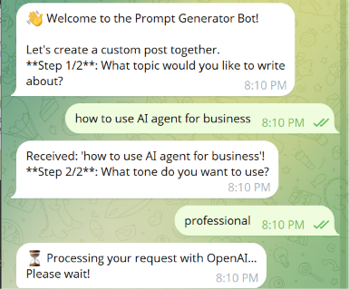
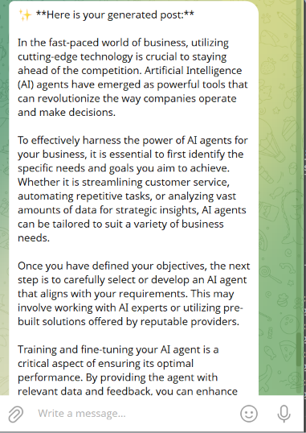

# 🤖 Telegram AI Content Generator Bot (Ver 1)

> X (Twitter) creators frequently burn out and hit writer's block when trying to maintain a high-volume weekly posting. This application generates instant post drafts based on a chosen topic and tone, so creators don't have to start writing from a blank page every time.
---

## ✨ How to use the app:


| Step 1: Topic & Tone Selection | Step 2: AI Output |
| :---: | :---: |
|  |  |

---


- 📝 **Set Topic & Tone (Text Input)**
  - **Action:** Open the chatbot, then send your topic and preferred tone to the bot (e.g., Topic: Time Management | Tone: Professional). 
  - **Result:** The bot delivers your complete, formatted post directly into the chat.

- 🔄 **Reset or Cancel Anytime (`/reset` / `/cancel`)**
  - **Action:** Type `/reset` or `/cancel` at any point.
  - **Result:** The bot clears all session memory and confirms: *"session reset clean!"*

---

## 📁 File Structure

```text
TelgramBot basic Antigravity/
├── assets/              # Screenshot previews for documentation
├── main.py              # Entry point: initializes bot application, loads handlers, starts polling
├── bot_handlers.py      # Conversation state machine (handles /start, topic, tone, /cancel, /reset)
├── openai_service.py    # Asynchronous OpenRouter/OpenAI API wrapper for prompt generation
├── config.py            # Environment variable loader for API secrets
├── .env.example         # Template for environment variables (tracked by Git)
├── .env                 # Local secrets file storing actual API tokens (Git-ignored)
├── requirements.txt     # Python project dependencies
└── README.md            # Main documentation and project guide
```

---

## 🚀 How to Run It

### Prerequisites
- Python 3.9+
- A Telegram Bot Token (obtained from [@BotFather](https://t.me/BotFather))
- An OpenRouter or OpenAI API Key

### Step-by-Step Setup

1. **Clone the Repository**
   ```bash
   git clone https://github.com/RikarudoJr/Telegram-AI-Content-Generator-Bot.git
   cd Telegram-AI-Content-Generator-Bot
   ```

2. **Install Dependencies**
   ```bash
   pip install -r requirements.txt
   ```

3. **Configure Environment Variables**
   Create a `.env` file in the root directory (or copy from `.env.example`):
   ```bash
   cp .env.example .env
   ```
   Fill in your tokens in `.env`:
   ```env
   TELEGRAM_BOT_TOKEN=your_telegram_bot_token_here
   OPENAI_API_KEY=your_openrouter_or_openai_api_key_here
   ```

4. **Start the Bot**
   ```bash
   python main.py
   ```
5. Open Telegram, search for your bot, and send `/start`!

---


### 🧠 What I Learned
* **AI Collaboration with Antigravity:** Partnered with Antigravity AI to build features faster, fix bugs quickly, and organize clear project documentation.

* **Generative AI Integration:** Integrated the OpenAI API so the chatbot can generate an AI reply directly to the user.
* **Processing Incoming Messages & Session State:** Learned how to capture user input and conversation context in real time, process it, and return an instant reply to the user's screen.
---

## 🔮 Future Improvements (Version 2.0 Roadmap)

- [ ] **Interactive Telegram Buttons**: Replace raw text input with clickable inline keyboard buttons for selecting tones (e.g., `[💼 Professional]`, `[🔥 Punchy]`) to streamline user experience.
- [ ] **Multi-Format Output Selection**: Allow users to select target content formats (e.g., Tweet Thread, LinkedIn Post, or Newsletter Intro) by swapping dynamic system prompts in `openai_service.py`.
- [ ] **Output Refinement & Regeneration**: Add interactive follow-up action buttons (`[🔄 Regenerate]`, `[✂️ Make Shorter]`) directly under generated responses to allow prompt tweaking within the active session.

